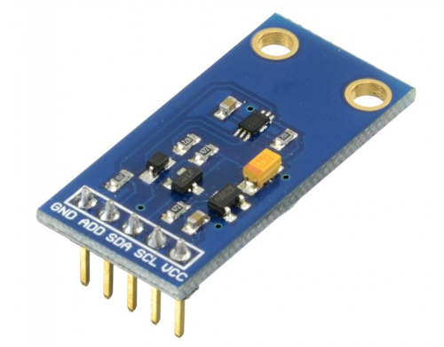
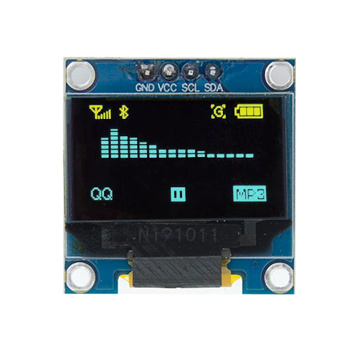

# Weather Station

A Weather Station with OLED display and Temperature, Humidity, Atmospheric Pressure and Light sensors. Weather data and forecasts are fetched from [OpenWeatherMap.org](https://openweathermap.org/), sensor readings are shown on OLED display and uploaded to the [ThingSpeak IoT platform](https://thingspeak.com/). All coded in [MicroPython](https://micropython.org).

## Hardware

#### DOIT ESP32 DEVKit v1 dev board
30 pin ESP32 development board.

#### Aosong AM2320 sensor
I2C sensor that measures temperature and humidty. Default I2C address is **0x5C**.

#### Bosch BMP180 sensor
I2C sensor that measures temperature, atmospheric pressure and altitude. Default I2C address is **0xD0**.

#### Mouser Electronics BH1750FVI sensor
I2C sensor that measures light intensity. Default I2C address is **0x23**.

#### OLED 0.96" display
I2C monochrome display (Yellow and Blue) with a resolution of 128x64 pixels with a SSD1306 driver. Default I2C address is **0x3C**.

## Wiring

|ESP32 Pin|AM2320 Pin|BMP180 Pin|BH1750 Pin|OLED Pin|
|:-:|:-:|:-:|:-:|:-:|
|3V|1|VIN|VCC|VCC|
|GND|3|GND|GND|GND|
|D22|4|SCL|SCL|SCL|
|D21|2|SDA|SDA|SDA|

## Debugging

|ESP32 Pin|Value|Debug|
|:-:|:-:|:-:|
|D5*|LOW|ON|
|D5*|HIGH|OFF|

(*) Pin D5 needs to be configured with **internal pull-up**

## Datasheets

- [AM2320](resources/AM2320.pdf)
- [BMP180](resources/BST-BMP180-DS000-09.pdf)
- [BH1750FVI](resources/bh1750fvi-e-186247.pdf)
- [SSD1306](resources/SSD1306.pdf)

## MicroPython code

#### [code](weather_station.py)

#### Modules

|Module|Description|Installation|
|:-|:-|:-|
|machine|functions related to hardware|(builtin)|
|network|network configuration|(builtin)|
|ntptime|synchronize RTC time with NTP server|(builtin)|
|utime|time related functions|(builtin)|
|sys|system specific functions|(builtin)|
|framebuf|frame buffer manipulation|(builtin)|
|freesans20|FreeSans font converted to py|https://github.com/peterhinch/micropython-font-to-py|
|writer_minimal|writer for py fonts|https://github.com/peterhinch/micropython-font-to-py|
|am2320|Aosong AM2320 I2C driver|https://github.com/mcauser/micropython-am2320|
|bmp180|Bosch BMP180 I2C driver|https://github.com/micropython-IMU/micropython-bmp180|
|bh1750|Mouser Electronics BH1750 driver|https://github.com/PinkInk/upylib/tree/master/bh1750|
|urequests|HTTP library|https://github.com/micropython/micropython-lib/tree/master/urequests

### Configuration

|Module|Variables|Description|
|:-|:-:|:-|
|config|SCL_PIN & SDA_PIN|I2C clock and data Pin|
|config|LED_PIN|Onboard LED Pin used as error indicator|
|config|LED_ON & LED_OFF|Inverse logic on onboard LED|
|config|DEBUG_PIN|Pin used for debugging (LOW to set ON)|
|config|FAHRENHEIT|Display temperatures in Fahrenheit (True/False)|
|config|PAGES|Names of pages to display on the OLED|
|config|TIMEZONE|Time difference from UTC in hours (+/-)|
|config|DAYLIGHT_SAVING_TIME|Adjust 1 hour for DST (True/False)|
|config|INTERVAL|Interval between sensor readings (seconds)|
|config|SSID & PASS|SSID and Password of the WiFi network to connect to|
|config|MAX_TRIES|Maximum number of tries to connect to the network (1 sec interval)|
|config|OPENWEATHER_API|OpenWeather API key| 
|config|OPENWEATHER_CITY|OpenWeather City and 2-letter contry code for the current weather data|
|config|OPENWEATHER_URL1|OpenWeather url for the current weather data|
|config|OPENWEATHER_URL2|OpenWeather url for the 7-day forecast weather data|
|config|THINGSPEAK_WRITE_API|ThingSpeak Write API key|
|config|THINGSPEAK_READ_API|ThingSpeak Read API key|
|config|THINGSPEAK_URL|ThingSpaek url for uploading the sensor data|

#### Functions

|Function|Description|
|:-|:-|
|show_error()|visual display of error condition - flashing onboard LED|
|debug_on()|check if debugging is on - debug pin LOW|
|connect_wifi()|connect the µcontroller to the local wifi network|
|synchronize_rtc()|synchronize the date and time on the µcontroller to local time|
|get_weather_data()|get current weather data and forcasts from OpenWeather.org|
|temperature_2_unit()|return temperature in the correct units (see config.FAHRENHEIT)|
|get_sensor_readings()|get readings from all connected sensors|
|load_pbm_image()|load a PBM (Portable Bitmap) image into the framebuffer of the OLED display|
|update_oled_display()|update the OLED display with config.PAGES of data|
|log_sensor_readings()|upload the sensor readings to ThingSpeak|
|deepsleep_till_next_cycle()|put the µcontroller into deepsleep for config.INTERVAL seconds|
|run()|main program logic|

